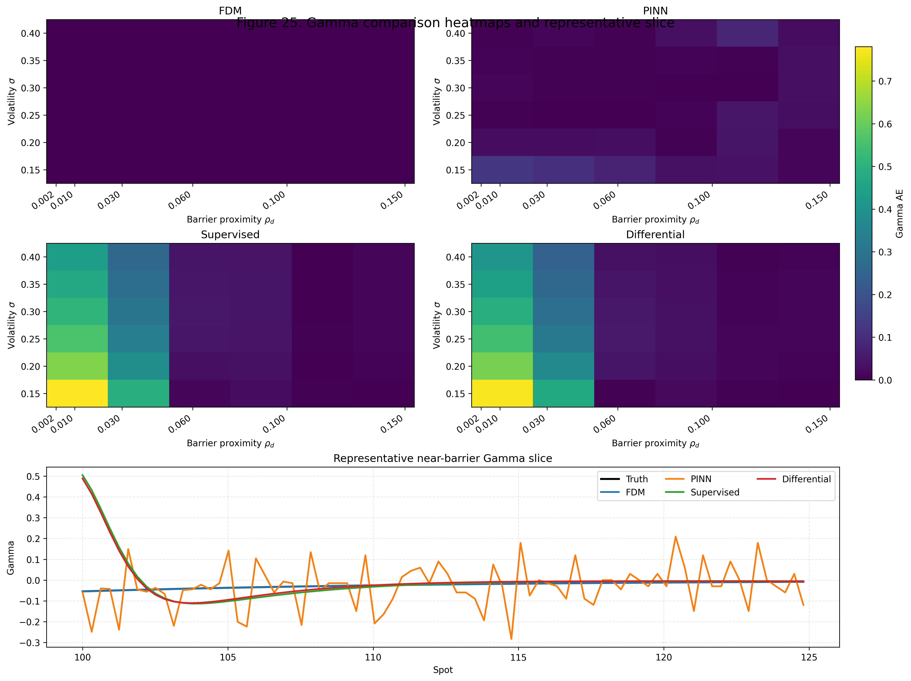

# Structurally Constrained PINNs for Barrier Option Pricing

This repository is the reproducibility package for the working paper:

**Structurally Constrained PINNs for Barrier Option Pricing: Benchmarking Against High-Precision Implicit Finite Differences**

SSRN working paper: forthcoming. Current SSRN positioning notes are in [docs/ssrn.md](docs/ssrn.md); replace this line with the assigned SSRN URL after upload.

GitHub repository: <https://github.com/uiclxh/structurally-constrained-pinns-barrier-options>

## Overview

This project studies whether structurally constrained physics-informed neural networks can be made credible for continuously monitored down-and-out European call option pricing under the Black-Scholes framework.

Barrier options are a demanding test case for neural PDE solvers because the absorbing boundary creates a localized high-curvature region near the knockout boundary. A model can look acceptable under average pricing error while still failing near the barrier, especially in Delta, Gamma, and boundary consistency.

The project compares a strong implicit finite-difference benchmark with barrier-aware neural surrogates. The retained neural framework combines transformed coordinates, hard barrier enforcement, barrier-aware adaptive collocation, hybrid optimization, and protocol-based validation.

## Reproducibility Status

This is a curated reproducibility package, not a clean-room rebuild.

The repository provides the final working paper, generated figures, generated tables, trained model artifacts, validation scorecards, residual diagnostics, and chapter-level summary files used by the manuscript. Some workflows can be rerun from `src/`, but the repository is not yet a fully packaged one-command software system that rebuilds every result from a fresh environment.

For details, see [docs/reproducibility.md](docs/reproducibility.md).

## Core Results

- The implicit finite-difference benchmark remains the strongest method for local pricing accuracy and Greek-sensitive tasks.
- Naive PINNs fail systematically in near-barrier high-curvature regimes.
- Hard barrier enforcement and barrier-aware adaptive collocation materially improve learned behavior.
- The barrier-aware PINN is the strongest learned model in near-barrier Gamma control and boundary consistency.
- No learned surrogate passes the full validation protocol in the current workflow.
- Learned surrogates become economically relevant only under sufficiently large repeated-query workloads and acceptable task-specific error tolerance.

## Main Result Snapshot

The table below condenses the validation scorecard. Lower values are better for price q95, near-barrier Gamma q95, barrier residual, and residual q95.

| Model | Price q95 (%) | Near-barrier Gamma q95 | Barrier residual max | Residual q95 | Validation status |
| --- | ---: | ---: | ---: | ---: | --- |
| FDM benchmark | **0.018** | **0.0007** | **4.84e-14** | 0.509 | Strongest local-precision reference |
| Barrier-aware PINN | 21.322 | **0.106** | **8.67e-06** | 9.957 | Strongest learned model for Gamma and barrier consistency |
| Supervised surrogate | 18.978 | 0.747 | **6.44e-06** | 132.134 | Fast inference, weak near-barrier Gamma |
| Differential surrogate | 18.605 | 0.739 | **6.44e-06** | 133.814 | Delta-aware baseline, still weak near the barrier |



Runtime economics are conditional on workload size and validation status:

| Method | Inference latency (s) | Batch throughput (contracts/s) | Break-even N* | Validation status |
| --- | ---: | ---: | ---: | --- |
| FDM | 0.003451 | - | 0 | Benchmark |
| PINN | 0.000153 | 1,893,293 | 58,195 | Pass gamma + barrier |
| Supervised surrogate | 0.000175 | 1,376,967 | 36,765 | Pass barrier only |

Full tables are available in `results/results_chapter8_only/table14_validation_scorecard.csv` and `results/results_chapter9_only/table15_runtime_inputs_break_even_summary.csv`.

## Repository Structure

```text
paper/
  Final working paper PDF.

src/
  Chapter-level Python research scripts.

scripts/
  Reproduction helper scripts.

docs/
  SSRN notes, project summary, and reproducibility statement.

results/
  Curated chapter-level result packages from Chapter 3 through Chapter 10.

figures/
  Selected figure and table-image exports for quick browsing.

tables/
  Selected CSV and LaTeX table exports for quick inspection.

models/
  Trained surrogate model artifacts and related metadata.
```

## Chapter Map

| Chapter | Folder | Purpose |
| --- | --- | --- |
| 3 | `results/results_chapter3_only/` | High-precision implicit finite-difference benchmark and convergence verification. |
| 4 | `results/results_chapter4_only/` | Barrier-aware neural surrogate framework, architecture tables, loss terms, and initial model artifact. |
| 5 | `results/results_chapter5_only/` | Validation protocol, data panels, metric dictionary, and acceptance rule. |
| 6 | `results/results_chapter6_only/` | Scenario-family construction, baseline family, and comparison design. |
| 7 | `results/results_chapter7_only/` | Formal ablation and failure diagnostics for naive PINNs, coordinate transforms, hard barrier ansatz, and BAAC. |
| 8 | `results/results_chapter8_only/` | Accuracy, Greek diagnostics, boundary consistency, residual diagnostics, scorecard, and trained surrogate models. |
| 9 | `results/results_chapter9_only/` | Runtime measurements, break-even analysis, throughput comparison, and repeated-query use cases. |
| 10 | `results/results_chapter10_only/` | Solver-selection decision map, research roadmap, and summary of established versus non-established claims. |

## Quickstart

Clone the repository:

```powershell
git clone https://github.com/uiclxh/structurally-constrained-pinns-barrier-options.git
cd structurally-constrained-pinns-barrier-options
```

Create and activate a Python environment. The target environment is Python 3.11 with CPU-only PyTorch:

```powershell
python -m venv .venv
.\.venv\Scripts\Activate.ps1
python -m pip install --upgrade pip
python -m pip install -r requirements.txt
```

For a stricter pip environment, use:

```powershell
python -m pip install -r requirements-lock.txt
```

For Conda or Mamba, use:

```powershell
conda env create -f environment.yml
conda activate barrier-pinn-repro
```

The runtime results in Chapter 9 are hardware-dependent. The reported package is CPU-oriented; GPU runs may change latency, throughput, and break-even thresholds.

Run a lightweight subset of the workflow:

```powershell
powershell -ExecutionPolicy Bypass -File scripts/reproduce_all.ps1 -SkipHeavy
```

Run the full scripted workflow:

```powershell
powershell -ExecutionPolicy Bypass -File scripts/reproduce_all.ps1
```

The full workflow can take substantial time because Chapter 7 and Chapter 8 include neural training and evaluation. The curated outputs already included in `results/`, `figures/`, `tables/`, and `models/` are the primary reproducibility package.

## Reproduction Boundary

`scripts/reproduce_all.ps1` is a convenience runner for chapter-level scripts. It is useful for rerunning selected workflows and checking how the generated artifacts are organized.

It should not be read as a clean-room rebuild guarantee. The curated release already includes the reported figures, tables, trained artifacts, and result summaries. If you rerun scripts, inspect the regenerated chapter output folders before replacing the curated files under `results/`, `figures/`, `tables/`, or `models/`.

Use `-SkipHeavy` for a faster pass that skips the neural-training and runtime-heavy chapters:

```powershell
powershell -ExecutionPolicy Bypass -File scripts/reproduce_all.ps1 -SkipHeavy
```

## Suggested Reading Order

1. Read the final PDF in `paper/`.
2. Review the validation scorecard in `results/results_chapter8_only/table14_validation_scorecard.csv`.
3. Inspect the runtime break-even table in `results/results_chapter9_only/table15_runtime_inputs_break_even_summary.csv`.
4. Check the decision map and roadmap in `results/results_chapter10_only/`.
5. Use `src/README.md` if you want to trace which script generated each chapter-level output.

## Licensing

This repository uses mixed licensing because it contains code, manuscript material, generated research outputs, and trained model artifacts.

- Code, scripts, and repository documentation are licensed under the MIT License. See [LICENSE](LICENSE).
- Paper, figures, tables, results, and model weights have separate terms. See [LICENSE-CONTENT.md](LICENSE-CONTENT.md).

The models and numerical outputs are research artifacts. They are not production trading systems and should not be used for live pricing, risk management, or investment decisions without independent validation.

## Citation

If you use this repository, please cite the working paper and repository. GitHub can read the citation metadata from [CITATION.cff](CITATION.cff).
